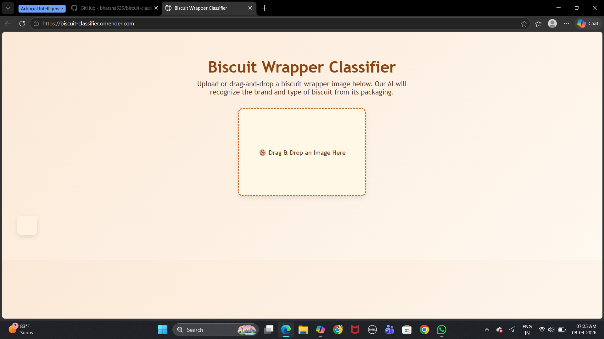
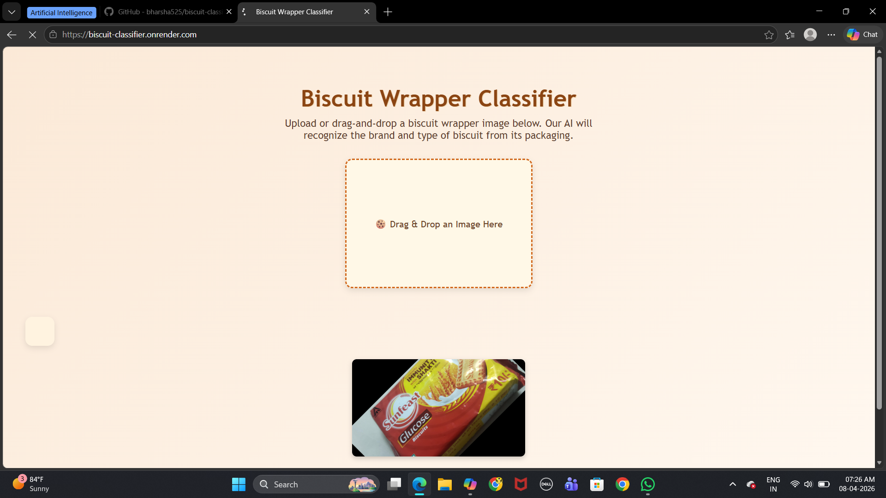
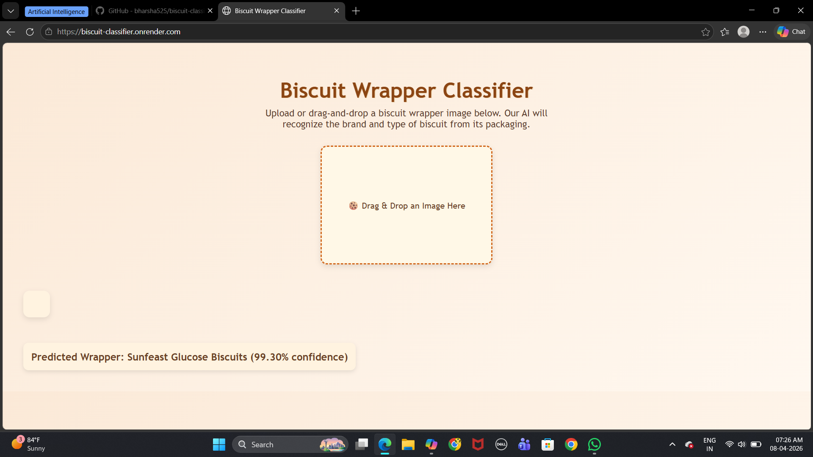

🍪 BISCUIT WRAPPER CLASSIFIER
An AI-powered web application that classifies biscuit wrapper images into their respective brands using a Convolutional Neural Network (CNN).

LIVE DEMO
👉 Click here to try the app

ABOUT THE PROJECT
This project builds a deep learning model capable of automatically identifying biscuit brands from their packaging images. It serves as a tool for:
* Market researchers to analyze design trends and consumer preferences
* Packaging designers to draw inspiration from diverse wrapper styles
* AI enthusiasts to explore real-world image classification

HOW IT WORKS
User uploads a biscuit wrapper image
The image is preprocessed and resized to 224×224
A CNN model predicts the brand from 100 biscuit categories
The app displays the predicted brand with a confidence score

PROJECT STRUCTURE
biscuit-classifier/
   │
   ├── app.py                  # Flask backend
   ├── requirements.txt        # Python dependencies
   ├── runtime.txt             # Python version
   ├── templates/
       └── index.html          # Frontend UI
   ├── static/
   │   └── style.css           # Styling
   ├── screenshots/            # App screenshots (for README)
   │   ├── home.png
   │   └── result.png
   |   |__ prediction.png
   └── biscuit.ipynb           # Model training notebook

Supported Biscuit Brands (100 Classes)
Includes brands like:
Britannia, Parle, Sunfeast, McVities
Cadbury, UNIBIC, Cremica, Priyagold
Sri Sri Tattva, Patanjali, Bonn, and many more!

TECH STACK
[ Frontend Layer ]
   → HTML, CSS
       ↓
[ Backend Layer ]
   → Python, Flask
       ↓
[ ML Model Layer ]
   → CNN (TensorFlow/Keras)
       ↓
[ Model Format ]
   → TFLite (quantized)
       ↓
[ Hosting Layer ]
   → Render

RUN LOCALLY
1. Clone the repository
git clone https://github.com/bharsha525/biscuit-classifier.git
cd biscuit-classifier

2. Create a virtual environment
python -m venv venv
venv\Scripts\activate      # Windows
source venv/bin/activate   # Mac/Linux

3. Install dependencies
pip install -r requirements.txt

4. Run the app
python app.py

5. Open in browser
http://localhost:5000

MODEL DETAILS
- Architecture
  - Convolutional Neural Network
- Input
  - 224 × 224 pixels
- Output
  - 100 Biscuit Brands
- Model Size
  - Original: 2.15 GB (.h5)
  - Optimized: 21.2 MB (.tflite)
- Compression
  - ~99% reduction
- Optimization
  - Post-Training Quantization
- Hosting
  - Google Drive (auto-download)
- Framework
  - TensorFlow / Keras

SCREENSHOTS

AUTHOR
Harsha — GitHub @bharsha525

